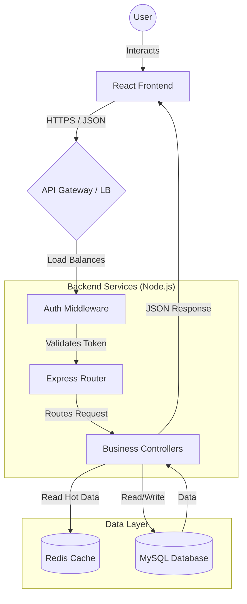
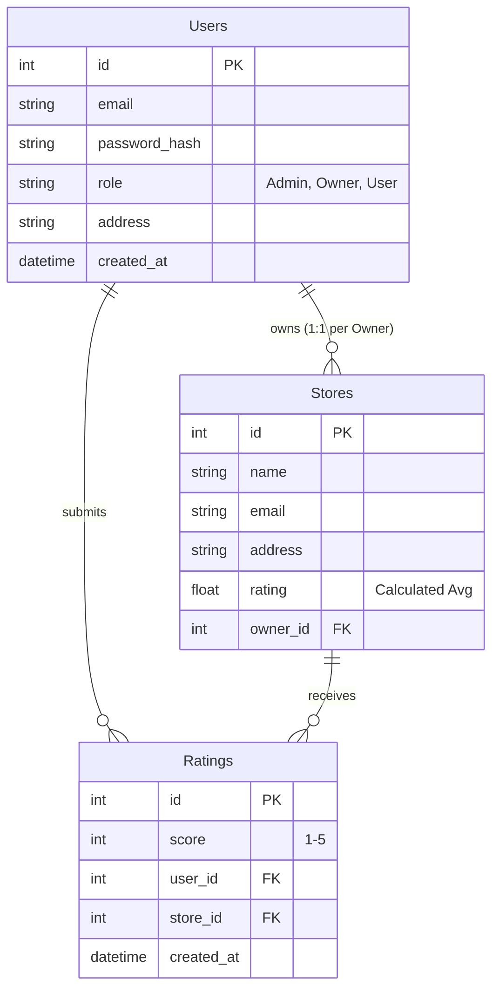

# System Design Document (SDD) - Roxiler Systems

**Role:** Senior Solutions Architect
**Project:** Store Rating & Management Platform
**Date:** 2025-12-17

---

## 1. System Overview

**Architectural Pattern:** **Layered Monolithic Architecture**

For the Roxiler Systems platform, we have selected a **Layered Monolith** pattern.

*   **Justification:**
    *   **Simplicity & Consistency:** The core domain entities (Users, Stores, Ratings) are highly relational and interdependent. A monolith allows for ACID-compliant transactions across these entities without the complexity of distributed data management.
    *   **Resource Efficiency:** Given the target traffic, a single optimized application server cluster (Node.js) connected to a robust relational database (MySQL) provides the best performance-to-cost ratio.
    *   **Migration Path:** The code is structured in modular controllers, allowing distinct domains (e.g., "Rating Engine") to be extracted into microservices if scaling requirements change significantly in the future.

---

## 2. Data Flow Architecture (Visual)

This diagram illustrates the request processing pipeline from the end-user to the data layer.

---

## 3. Database Schema (Visual)

The database uses a relational model to enforce referential integrity between Owners, Stores, and consumer Ratings.

---

## 4. Core Component Breakdown

### A. Authentication
*   **Mechanism:** **JWT (JSON Web Tokens)**.
*   **Process:**
    1.  User exchanges credentials for a signed JWT via `/api/auth/login`.
    2.  Token contains `userId` and `role`.
    3.  Token is sent in the `Authorization: Bearer` header.
    4.  Middleware verifies the signature and checks `role` permissions before allowing access to protected routes.

### B. Business Logic
The core processing resides in the **Controller Layer** of the Node.js application:
*   **Store Controller:** Handles store registration logic, ensuring the "one store per owner" business rule.
*   **Rating Controller:** Validates rating submissions (1-5 scale) and prevents duplicate ratings if necessary.
*   **Stats Controller:** Performs real-time aggregation of reviews to serve the dashboards.

### C. Third-Party Integrations
*   **Cloudinary (Potential):** For storing store logo/images (future).
*   **Email Provider (e.g., SendGrid):** For transactional emails (Welcome, Password Reset) (future).
*   **Maps API (e.g., Google Maps):** For address validation and geocoding during store registration (future).

---

## 5. Non-Functional Requirements

### Scalability
*   **Horizontal Scaling:** The backend is stateless. We can deploy multiple instances of the Node.js server behind a Load Balancer (e.g., Nginx or AWS ALB) to handle increased traffic.
*   **Caching Strategy:**
    *   **Application Level:** Use **Redis** to cache the response of `/api/public/stores`.
    *   **Cache Invalidation:** The cache is cleared or updated whenever a new rating is posted to ensure data freshness.

### Reliability
*   **Failure Handling:**
    *   **Retries:** The client (React) implements exponential backoff retries for failed network requests.
    *   **Graceful Degradation:** If the Database is slow, the system serves cached data/content where possible.
    *   **Circuit Breakers:** Implemented for any future external API calls (e.g., Payment Gateway) to prevent cascading failures.
*   **Monitoring:** Health check endpoint `/health` allows the Load Balancer to remove unhealthy instances automatically.
